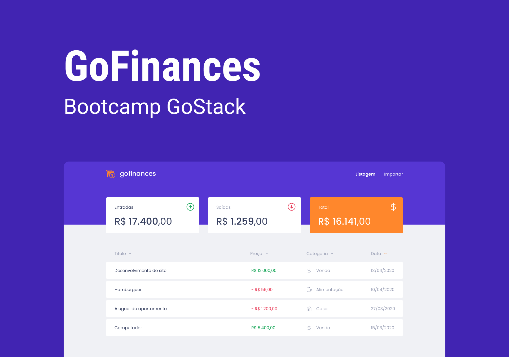

[![Forks][forks-shield]][forks-url]
[![Stargazers][stars-shield]][stars-url]
[![Issues][issues-shield]][issues-url]
[![MIT License][license-shield]][license-url]
[![LinkedIn][linkedin-shield]][linkedin-url]


<!-- PROJECT LOGO -->
<br />
<p align="center">
  <a href="https://github.com/jotace1/GoFinances">
    
  </a>

  <h3 align="center">GoFinances</h3>

  <p align="center">
   Aplicação feita utilizando ReactJS & Typescript
    <br />
    <a href="https://github.com/jotace1/GoFinances"><strong>Explore the docs »</strong></a>
    <br />
    <br />
    <a href="https://github.com/jotace1/GoFinances">View Demo</a>
    ·
    <a href="https://github.com/jotace1/GoFinances/issues">Report Bug</a>
    ·
    <a href="https://github.com/jotace1/GoFinances/issues">Request Feature</a>
  </p>
</p>


<!-- TABLE OF CONTENTS -->
## 📎 Table of Contents

* [About the Project](#about-the-project)
  * [Built With](#built-with)
* [Getting Started](#getting-started)
  * [Prerequisites](#prerequisites)
  * [Installation](#installation)
* [Usage](#usage)
* [Roadmap](#roadmap)
* [Contributing](#contributing)
* [License](#license)
* [Contact](#contact)


<!-- ABOUT THE PROJECT -->
## :mag_right: About The Project
<p align="center">

</p>


### 💻 Built With

* [ReactJS](https://pt-br.reactjs.org/)
* [Typescript](https://www.typescriptlang.org/)


<!-- GETTING STARTED -->
## Getting Started

To get a local copy up and running follow these simple steps.

### ⚙ Prerequisites

This is an example of how to list things you need to use the software and how to install them.


* npm or yarn
```sh
npm install npm@latest -g
```
or
```sh
yarn
```

### 📙 Installation

* <strong>First you must to have the backend, you can get it clicking <a href="https://github.com/jotace1/desafio-gostack-06">HERE</a></strong>

* After you got the backend you are able to do this next steps

1. Clone the repo
```sh
git clone https://github.com/jotace1/GoFinances.git
```
2. Install packages
```sh
npm install
```
or
```sh
yarn
```
3. Run the app
```sh
yarn start
```


<!-- USAGE EXAMPLES -->
## 🚀 Usage
After running the app, u can make income transactions and outcome transactions.

Have fun


## Roadmap

See the [open issues](https://github.com/jotace1/GoFinances/issues) for a list of proposed features (and known issues).


<!-- CONTRIBUTING -->
## 📙 Contributing

Contributions are what make the open source community such an amazing place to be learn, inspire, and create. Any contributions you make are **greatly appreciated**.

1. Fork the Project
2. Create your Feature Branch (`git checkout -b feature/AmazingFeature`)
3. Commit your Changes (`git commit -m 'Add some AmazingFeature'`)
4. Push to the Branch (`git push origin feature/AmazingFeature`)
5. Open a Pull Request


<!-- LICENSE -->
## 📝 License

Distributed under the MIT License. See `MIT` for more information.


<!-- CONTACT -->
## :calling: Contact

João Carlos de Souza Castro - [Linkedin](https://www.linkedin.com/in/joaocsc/) - joaocsc01@hotmail.com

Project Link: [https://github.com/jotace1/GoFinances](https://github.com/jotace1/GoFinances)


<!-- MARKDOWN LINKS & IMAGES -->
<!-- https://www.markdownguide.org/basic-syntax/#reference-style-links -->
[contributors-shield]: https://img.shields.io/github/contributors/jotace1/GoFinances.svg?style=flat-square
[contributors-url]: https://github.com/jotace1/GoFinances/graphs/contributors
[forks-shield]: https://img.shields.io/github/forks/jotace1/GoFinances.svg?style=flat-square
[forks-url]: https://github.com/jotace1/GoFinances/network/members
[stars-shield]: https://img.shields.io/github/stars/jotace1/GoFinances.svg?style=flat-square
[stars-url]: https://github.com/jotace1/GoFinances/stargazers
[issues-shield]: https://img.shields.io/github/issues/jotace1/GoFinances.svg?style=flat-square
[issues-url]: https://github.com/jotace1/GoFinances/issues
[license-shield]: https://img.shields.io/github/license/jotace1/GoFinances.svg?style=flat-square
[license-url]: https://github.com/jotace1/GoFinances/blob/master/LICENSE
[linkedin-shield]: https://img.shields.io/badge/-LinkedIn-black.svg?style=flat-square&logo=linkedin&colorB=555
[linkedin-url]: https://www.linkedin.com/in/joaocsc/

